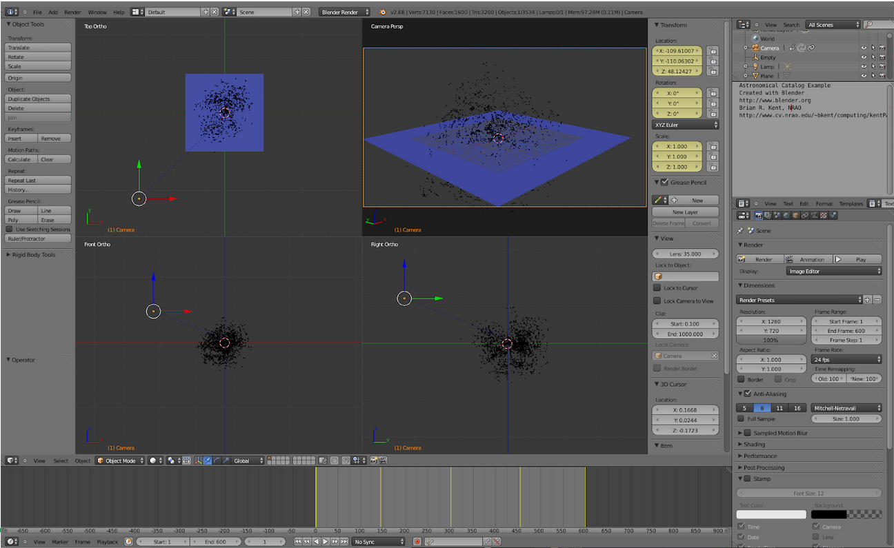

# American Physical Society 2021 Visualization Demo #

Dr. Brian R. Kent, Scientist, National Radio Astronomy Observatory

### Files: ###
BKent-APS-Blender-Tutorial-2021.pdf  
bkentAPSfinal.blend  
bkentAPSstart.blend  
edd.txt  
video.mp4


## March 2021 American Physical Society Conference

_Requirements:_  
 - Linux, Windows, or Mac computer (laptop is sufficient)
 - Blender download ([https://download.blender.org/release/Blender2.78/](https://download.blender.org/release/Blender2.78/) )
 - Data:  Extragalactic Distance Database ([http://edd.ifa.hawaii.edu/](http://edd.ifa.hawaii.edu/))
 - Basic knowledge of Python
 - This Git repository:   **git clone https://github.com/brkent/aps2021.git**

We can render the positions of objects in 3D space - in this case the locations of galaxies in the nearby Universe from the extragalactic distance database.  This tutorial will use the following concepts:

 - Importing formatted data in the Blender GUI with Python code and using the API
 - Setting up a Cartesian grid with the appropriate physical units
 - Determining the camera position, field of view, and keyframes
 - Render a high resolution output


The following steps will set up this visualization.


*   Add a plane with Add → Mesh → Plane. Scale the plane with the S key and press TAB to 
enter Mesh Edit mode. Subdivide the plane five times and press TAB one more time 
to again return to Object mode.
*   Add a material to the plane mesh on the Properties panel and set the type to
‘Wire’. Choose a color that contrasts well with the background—blue on
black usually works well.
*   Set the ‘Emit’ value to 1.5
*   Set the World tab background horizon color on the Properties panel to black.
*   Add a simple mesh with Add → Mesh → Circle. Press TAB to enter Mesh Edit mode, SHIFT select all but one of the vertices and press X to remove them. 
Press TAB one more time to go back to Object mode.

    ```
    # 3D Catalog Example
    # http://www.cv.nrao.edu/~bkent/blender
    '''
    Please note that this Python script  should be run inside the Blender environment.
    '''
    import math
    import bpy

    # MODIFY THIS DIRECTORY TO YOUR HOME MACHINE
    dir_loc = '/export/data_2/blender/catalog/'
    filename = 'edd.txt'
    filepath = dir_loc + filename

    # Read in ASCII data into nested list
    with open(filepath) as f:
       lis=[x.split() for x in f]
    cols=[x for x in zip(*lis)]

    # Separate columns
    names = cols[0]
    dist = cols[1]
    x = cols[2]
    y = cols[3]
    z = cols[4]  
    
    # Create objects for each based on object template
    for i in range(0,len(x)):
        bpy.ops.object.duplicate()
        bpy.context.active_object.location.xyz=(float(x[i]),float(y[i]),float(z[i]))
    ```


The data should load quickly. We can now add a material to the galaxy catalog data points.


*   Select the data points and click the Materials tab on the Properties panel.
*   Select ‘Halo’ and change the size value to 0.005 and hardness value to 100.
A white or light yellow color can be used to color the points.

We can now use the default camera object to point at an Empty Object.


*   Add an empty object with Add → Empty → Plain Axes for the camera to track.
*   Right-click to choose the camera object and set the position and rotation 
values on the Transform toolbar to zero.
*   Click the Constraints tab on the right-hand side Properties panel.
*   Choose ‘Track To’ and select the target as ‘Empty’.
*   Select ‘To’ as –Z and ‘Up’ as Y. This will correctly orient the upward and normal 
directions when looking through the camera field of view.

Animate the visualization by keyframing the camera.


*   This animation will be 20 s long at 30 frames per second. Set the number of 
frames to 600 and set the current frame to 1.
*   Right-click to select the camera and press the I key to keyframe the position
and rotation of the camera.
*   On the Animation toolbar, set the current frame to 600. Move the camera in
the 3D view port to a different location and orientation.
*   Keyframe the camera position and rotation one final time with the I key.

The visualization can now be exported in a 1080p HD video.


*   On the Render tab (Render->Open GL on OSX)  in the Properties panel select HDTV 1080p and set the 
frame rate to 30 frames per second.


*   Set the output to AVI JPEG, quality 100 percent, and specify a unique filename. 
Click the ‘Animation’ button at the top of the tab to render the
visualization.



## Blender resources:

*   [BlenderGuru](http://blenderguru.com)			
*   [CG Cookie](http://cgcookie.com/blender/)			
*   [Blender Materials](http://matrep.parastudios.de/)		
*   [Tutorials and Modelling](http://bensimonds.com/tutorials/)
*   [Wiki Book](http://en.wikibooks.org/wiki/Blender_3D:_Noob_to_Pro)			
*   [BlenderDiplom](http://blenderdiplom.com/)
*   [BlenderNation](http://www.blendernation.com)			
*   [Blendtuts](http://www.blendtuts.com/)			
*   [Blender Models](http://www.blender-models.com/)		


## Videos and Tutorials:

[https://www.youtube.com/user/VisualizeAstronomy/videos](https://www.youtube.com/user/VisualizeAstronomy/videos)


## Publications:

3D Scientific Visualization with Blender: \
[https://iopscience.iop.org/book/978-1-6270-5612-0](https://iopscience.iop.org/book/978-1-6270-5612-0)

Visualization in Astronomy: \
[https://iopscience.iop.org/journal/1538-3873/page/Techniques-and-Methods-for-Astrophysical-Data-Visualization](https://iopscience.iop.org/journal/1538-3873/page/Techniques-and-Methods-for-Astrophysical-Data-Visualization)

Extragalactic Distance Database: \
[https://ui.adsabs.harvard.edu/abs/2009AJ....138..323T/abstract](https://ui.adsabs.harvard.edu/abs/2009AJ....138..323T/abstract)

360 Video and Spherical Panoramas: \
[https://ui.adsabs.harvard.edu/abs/2017PASP..129e8004K/abstract](https://ui.adsabs.harvard.edu/abs/2017PASP..129e8004K/abstract)


